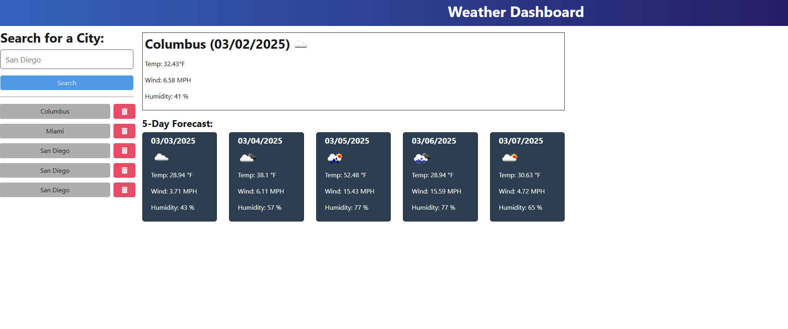

# Weather-Dash

## Description

This project is for a weather forecast dashboard. When cities are typed in the search bar, the weather forecast for a 5-day week is displayed.
A search history keeps log of the cities that were searched for previously and when selected it will bring up that city's weather forecast. Cities from the history can also be deleted.
Developing this project I've learned aspects of Server and API programming concepts and how to connect the back-end of a Web-API to the front-end.

## Table of Contents

- [Installation](#installation)
- [Usage](#usage)
- [Credits](#credits)

## Installation

If opening and using this app in a IDE; opening a terminal and running the command "npm run build" and "npm run install" will help to configure everything that is needed to run this project.

If there are still issues run a "npm i" in the command line.

This app is deployed using Render and below is a link:

https://weather-dash-de5g.onrender.com

## Usage

Below is a screenshot of the Weather Dashboard app. There is a city search bar, forecast data and list of previous searches of cities. When a city is searched, it'll load the forecast as in the image. Each city searched with also be logged into the history list and can be reselected to view that city's weather data when selected. The red button with a trash can symbol is the button to delete previous searched cities from the log.

## Credits

Below is my GitHub profile. Any suggestions to improve functionality and code, feel free to reach out to me!

GitHub: https://github.com/AVue00

Instructor/TA and Tutor help was utilized for some weather routing and weather service methods.

